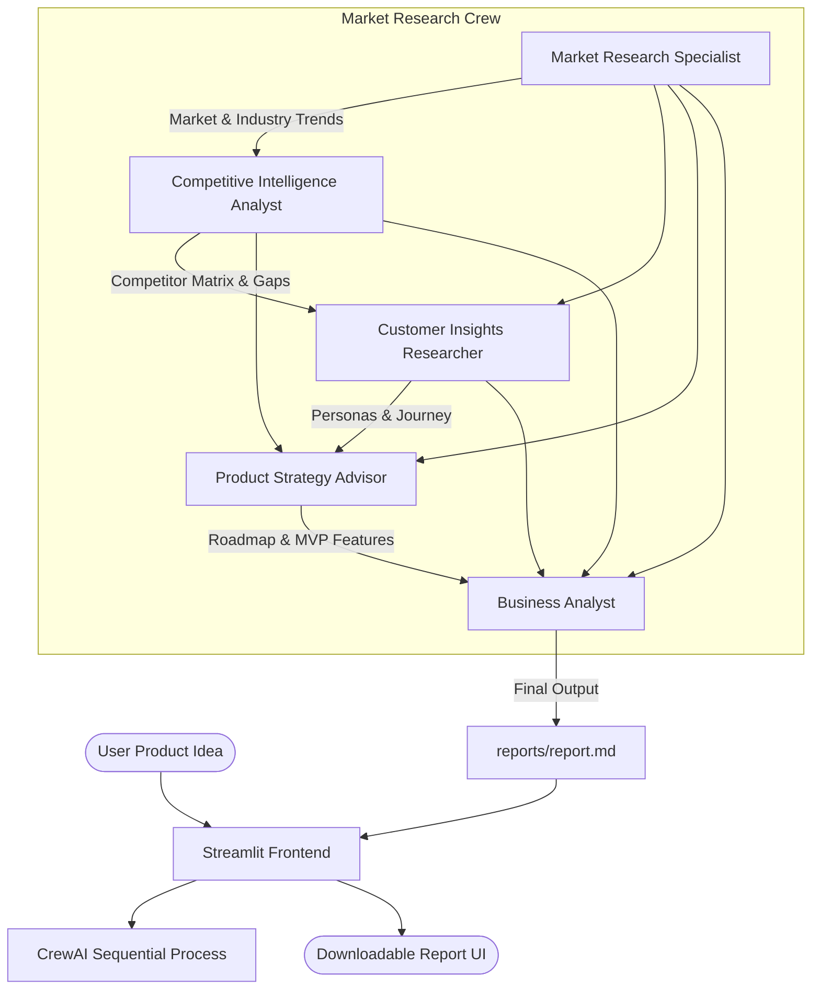

# MarketResearchCrew Crew

MarketResearchCrew Crew project is designed to help you set up a multi-agent AI system that performs comprehensive market research, identifies competitors, deeply understands target customers, designs product strategy, and outputs a final business analysis report.

## 🚀 Architecture

This crew employs a sequence of specialized AI agents to handle every aspect of market research sequentially:



## Installation

Ensure you have Python >=3.10 <3.14 installed on your system. This project uses [UV](https://docs.astral.sh/uv/) for dependency management and package handling, offering a seamless setup and execution experience.

First, if you haven't already, install uv:

```bash
pip install uv
```

Next, navigate to your project directory and install the dependencies:

```bash
crewai install
```
### Customizing

**Add your `OPENAI_API_KEY` into the `.env` file** *(Or configure your LLM provider as needed)*

- Modify `src/market_research_crew/config/agents.yaml` to define your agents
- Modify `src/market_research_crew/config/tasks.yaml` to define your tasks
- Modify `src/market_research_crew/crew.py` to add your own logic, tools and specific args

## Running the Project

To kickstart your crew of AI agents using the graphical interface:

```bash
streamlit run app.py
```

1. Enter your **Product Idea** into the text box.
2. Click **Generate Market Research**.
3. Watch the continuous **Live Execution Logs** expander to see the agents at work.
4. Download the finalized `report.md` via the provided download button.

### CLI Usage
If you prefer to run it strictly from the terminal (without the UI):
```bash
$ crewai run
```
*(This command requires hard-coded inputs inside `main.py`)*

## 📊 Evaluation Results


During testing, the Market Research Crew demonstrated exceptionally strong performance, achieving an impressive **overall average score of 9.6/10** with an execution time of 476 seconds. The specialized agents consistently delivered highly accurate and insightful results across all their respective tasks (scoring between 9.4 and 9.7 on average):

- **Customer Insights Researcher** and **Product Strategy Advisor** tied for the highest average score of **9.7**, indicating deep understanding of the customer base and excellent prioritization of actionable MVP features.
- **Market Research Specialist** and **Business Analyst and Report Synthesizer** also performed incredibly well with an average score of **9.5**, successfully extracting relevant macro trends and compiling the findings into a cohesive final business report.
- **Competitive Intelligence Analyst** achieved a strong **9.4**, thoroughly mapping the competitive landscape to find viable market gaps.

This highlights the crew's robust capability to execute comprehensive, data-driven market research and strategic planning autonomously, yielding production-ready business analysis material.

## Understanding Your Crew

The MarketResearchCrew is composed of multiple AI agents, each with unique roles, goals, and tools. These agents collaborate on a series of tasks, defined in `config/tasks.yaml`, leveraging their collective skills to achieve complex objectives. The `config/agents.yaml` file outlines the capabilities and configurations of each agent in your crew.
